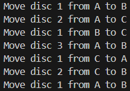

# Towers of Hanoi

This program solves the classic **Towers of Hanoi** problem using a recursive approach. The problem involves moving a stack of disks from one tower to another, following these rules:

1. You can only move one disk at a time.
2. A larger disk can never be placed on top of a smaller disk.
3. Use a third tower as a helper.

## Description

The program shows the necessary steps to move `n` disks from an origin tower to a destination tower, using an auxiliary tower. The algorithm solves the problem recursively:

- If there is only one disk, it moves it directly from the origin to the destination.
- If there are more than one disk, it first moves the top `n-1` disks to the auxiliary tower, then moves the largest disk to the destination, and finally moves the `n-1` disks from the auxiliary tower to the destination.

**Output**

## Contributing
Contributions are welcome! Please follow these steps:
1. **Fork the Repository**
2. **Create a Feature Branch (`git checkout -b feature-branch`)**
3. **Commit Your Changes (`git commit -m 'Add some feature'`)**
4. **Push to the Branch (`git push origin feature-branch`)**
5. **Open a Pull Request**
